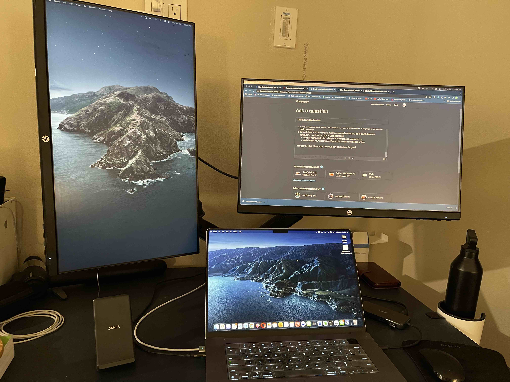
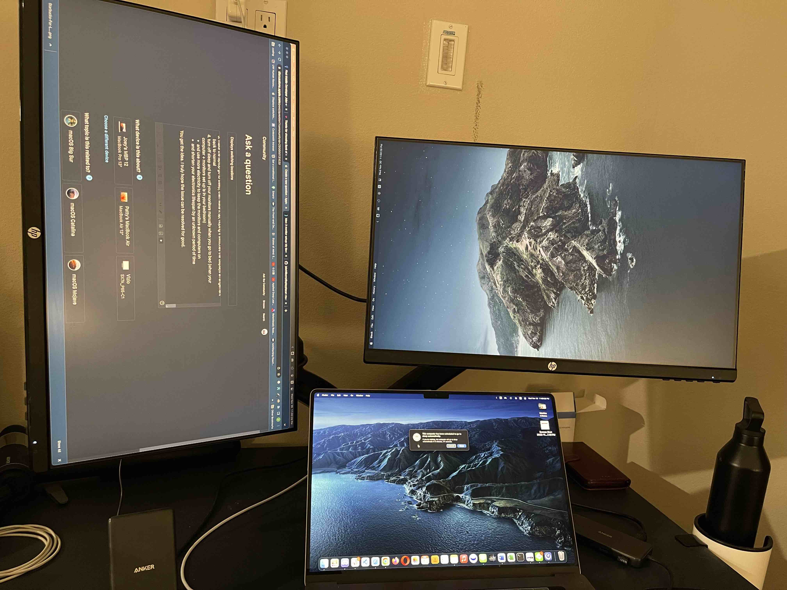
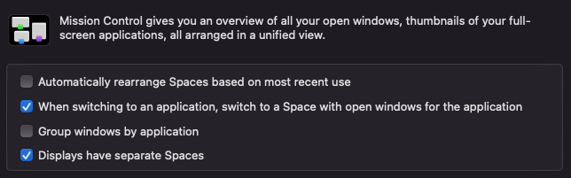

# mac-terminal-guide
Exploring the world of Terminal on macOS.

For a full list of Mac Termainal Commands, you can see here:
https://www.makeuseof.com/tag/mac-terminal-commands-cheat-sheet/

## Personal Touch

Inspired by a problem many and myself encountered, as well as seeing `jakehilborn`'s `displayplacer` (link here: [displayplacer](https://github.com/jakehilborn/displayplacer)) as a solution, I wanted to dig into how to possibly fix the problem myself and write some script *from scratch*. *For fun*. That repo seems abandoned and forgotten even though it's got 2.2k stars, 64 issues, and 4 PRs. For those who are not familiar, this is a problem that when using 2 external monitors of the same brand and model, the locations of displays would bet swapped (etc).

*No Problem:*

 

*Computer goes to sleep, and the problem comes back 7 / 10 times. (Estimate only)*



Also noting that this is an existing issue that is not getting an official resolution from Apple. I wrote a detailed post to the Apple Support Community, thinking I was being helpful by providing additional information and research around the topic, but it was removed by Apple because apparently my post "contained either feedback or a feature request that was not constructive." Maybe I got too passionate about wanting this problem solved and it sounded *not constructive*.

Here are some links I found that were related to this issue. 

2016/07/26: https://superuser.com/questions/1105308/mac-3-monitor-setup-my-desktop-set-keep-switching-places-between-monitors

2020/09/26: https://discussions.apple.com/thread/252455895

2021/02/15: https://discussions.apple.com/thread/251850559

2021/10/28: https://forums.macrumors.com/threads/external-displays-swapping-arrangement-not-remembered.2320211/

Before I got too far, I decided to try using a different connector to connect to my second monitor. It seemed to have solved this problem, for now (dated 12/12/2022).

### Current Setup

- 2021 16" Macbook Pro (MacBookPro18,1) with 16GB ram + 1TB SSD
- 1st external monitor is using either
  - some HDMI cable I found laying around
  - same HDMI cable connected + an Anker USB C Hub ([Amazon link](https://a.co/d/caTe866))
- 2nd external monitor is using 
  - a Benfei USB-C to VGA adapter ([Amazon link](https://a.co/d/09W7PM0)) + Amazon Basics VGA to VGA PC Computer Monitor Cable - 6 Feet (1.8 Meters) ([Amazon link](https://a.co/d/6RufxgE))

Here are my Mission Control check boxes:

 

### Note to Self

Will come back to this repo if the problem comes back again, but will leave this challenge for someone else or for when I am really *bored to death*.

## Personal Notes: 
### *Mac Termainal Commands That Were Interesting to Me*

| Syntax      | Description |
| ----------- | ----------- |
| export PATH=$PATH:absolute/path to/program/ | Execute a program via terminal only in your current session. If you use a program regularly, add the path to shell configuration file. |
| top | display live information about currently running processes. |
| system_profiler | reports system hardware and software configuration. |
| system_profiler -listDataTypes | Shows a list of the available data types. |
| system_profiler SPDisplaysDataType | Shows a list of the available display information. |
| system_profiler SPDisplaysDataType | Shows a list of the available Thunderbolt information. |
| system_profiler SPUSBDataType | Shows a list of the available USB information. |

### *To be organized*

Command + K Key to clear the screen 
Below are some Awesome Mac Command Line Commands
1. caffeinate
2. Top
3. sw_vers
4. system_profiler
5. softwareupdate
6. nettop
7. diskutil list
8. du
9. ls
10. say

Some examples of what I'm seeing: 

```zsh
yoyoyojoe@Joeys-MacBook-Pro ~ % system_profiler SPDisplaysDataType
Graphics/Displays:

    Apple M1 Pro:

      Chipset Model: Apple M1 Pro
      Type: GPU
      Bus: Built-In
      Total Number of Cores: 16
      Vendor: Apple (0x106b)
      Metal Family: Supported, Metal GPUFamily Apple 7
      Displays:
        Color LCD:
          Display Type: Built-in Liquid Retina XDR Display
          Resolution: 3456 x 2234 Retina
          Main Display: Yes
          Mirror: Off
          Online: Yes
          Automatically Adjust Brightness: Yes
          Connection Type: Internal
        HP V24i: # connected via HTMI 
          Resolution: 1920 x 1080 (1080p FHD - Full High Definition)
          UI Looks like: 1920 x 1080 @ 60.00Hz
          Mirror: Off
          Online: Yes
          Rotation: Supported
        HP V24i:
          Resolution: 1080 x 1920
          UI Looks like: 1080 x 1920 @ 60.00Hz
          Mirror: Off
          Online: Yes
          Rotation: 90

```

```zsh
yoyoyojoe@Joeys-MacBook-Pro ~ % system_profiler SPThunderboltDataType
Thunderbolt/USB4:

    Thunderbolt/USB4 Bus 2:

      Vendor Name: Apple Inc.
      Device Name: MacBook Pro
      UID: 0x05ACAE5D90B58042
      Route String: 0
      Domain UUID: C94A21D1-5EA0-4773-9F22-934D810FFD34
      Port:
          Status: No device connected
          Link Status: 0x100
          Speed: Up to 40 Gb/s x1
          Current Link Width: 0x1
          Receptacle: 3

    Thunderbolt/USB4 Bus 1:

      Vendor Name: Apple Inc.
      Device Name: MacBook Pro
      UID: 0x05ACAE5D90B58041
      Route String: 0
      Domain UUID: 9E2E9CED-6192-459C-8AD0-2BDC0CBCBEDB
      Port:
          Status: No device connected
          Link Status: 0x100
          Speed: Up to 40 Gb/s x1
          Current Link Width: 0x1
          Receptacle: 2

    Thunderbolt/USB4 Bus 0:

      Vendor Name: Apple Inc.
      Device Name: MacBook Pro
      UID: 0x05ACAE5D90B58040
      Route String: 0
      Domain UUID: 3090AEC0-794A-460E-9C95-33ACF86A59C9
      Port:
          Status: No device connected
          Link Status: 0x100
          Speed: Up to 40 Gb/s x1
          Current Link Width: 0x1
          Receptacle: 1
```

```zsh
yoyoyojoe@Joeys-MacBook-Pro ~ % system_profiler SPUSBDataType        
USB:

    USB 3.1 Bus:

      Host Controller Driver: AppleT6000USBXHCI

    USB 3.1 Bus:

      Host Controller Driver: AppleT6000USBXHCI

        USB3.1 Hub             : # connected to an ANKER PowerExpand 8-in-1 USB-C PD 10Gbps Data Hub

          Product ID: 0x0822
          Vendor ID: 0x2109  (VIA Labs, Inc.)
          Version: 6.a3
          Serial Number: 000000001 # SN: ACYSZ70B44500998, printed on hardware, not shown in software (here)
          Speed: Up to 10 Gb/s
          Manufacturer: VIA Labs, Inc.         
          Location ID: 0x02200000 / 2
          Current Available (mA): 900
          Current Required (mA): 0
          Extra Operating Current (mA): 0

            USB3.0 Hub             :

              Product ID: 0x0817
              Vendor ID: 0x2109  (VIA Labs, Inc.)
              Version: 4.93
              Serial Number: 000000000 
              Speed: Up to 5 Gb/s
              Manufacturer: VIA Labs, Inc.         
              Location ID: 0x02220000 / 5
              Current Available (mA): 900
              Current Required (mA): 0
              Extra Operating Current (mA): 0

                NS1081: # USB 3.0 Flash Card Controller

                  Product ID: 0x1081
                  Vendor ID: 0x2537
                  Version: 1.00
                  Serial Number: 0123456789ABCDE
                  Speed: Up to 5 Gb/s
                  Manufacturer: Norelsys
                  Location ID: 0x02224000 / 7
                  Current Available (mA): 900
                  Current Required (mA): 152
                  Extra Operating Current (mA): 0

                AX88179A: # USB-C to Ethernet Gigabit Network Adapter

                  Product ID: 0x1790
                  Vendor ID: 0x0b95  (ASIX Electronics Corporation)
                  Version: 2.00
                  Serial Number: 007D92DC
                  Speed: Up to 5 Gb/s
                  Manufacturer: ASIX
                  Location ID: 0x02221000 / 6
                  Current Available (mA): 900
                  Current Required (mA): 184
                  Extra Operating Current (mA): 0

        USB2.0 Hub             :

          Product ID: 0x2822
          Vendor ID: 0x2109  (VIA Labs, Inc.)
          Version: 6.a3
          Serial Number: 000000001
          Speed: Up to 480 Mb/s
          Manufacturer: VIA Labs, Inc.         
          Location ID: 0x02100000 / 1
          Current Available (mA): 500
          Current Required (mA): 0
          Extra Operating Current (mA): 0

            2.4G Receiver:

              Product ID: 0xfa23
              Vendor ID: 0x25a7
              Version: 2.41
              Speed: Up to 12 Mb/s
              Manufacturer: Compx
              Location ID: 0x02140000 / 3
              Current Available (mA): 500
              Current Required (mA): 100
              Extra Operating Current (mA): 0

            USB2.0 Hub             :

              Product ID: 0x2817
              Vendor ID: 0x2109  (VIA Labs, Inc.)
              Version: 4.93
              Serial Number: 000000000 # SN: WGSBLJ210601, printed on hardware, not shown in software (here)
              Speed: Up to 480 Mb/s
              Manufacturer: VIA Labs, Inc.         
              Location ID: 0x02120000 / 4
              Current Available (mA): 500
              Current Required (mA): 0
              Extra Operating Current (mA): 0

            Anker USB-C HUB Device :

              Product ID: 0x8383
              Vendor ID: 0x291a
              Version: 0.01
              Serial Number: 0000000000000001
              Speed: Up to 480 Mb/s
              Manufacturer: Anker                  
              Location ID: 0x02150000 / 8
              Current Available (mA): 500
              Current Required (mA): 100
              Extra Operating Current (mA): 0

    USB 3.1 Bus:

      Host Controller Driver: AppleT6000USBXHCI
```

Currently connected to an 
- ANKER PowerExpand 8-in-1 USB-C PD 10Gbps Data Hub, which includes
  - 1 x USB 3.0 Flash Card Controller
    - a microSD card reader
    - a SD card reader
  - 1 x USB-C to Ethernet Gigabit Network Adapter
  - 1 x HDMI port
  - 2 x USB-A data ports
  - 1 x USB-C data port
  - 1 x USB-C Power Delivery input port
  - location: on right side, between HDMI port & SDXC card slot
- BENFEI USB-C to VGA adapter (Male to Female)
  - location: on left side, closer to MagSafe 3 port

It seems like connected devices are not using their Serial Numbers.

Here's an image showing all 2021 16" Macbook Pro ports.


